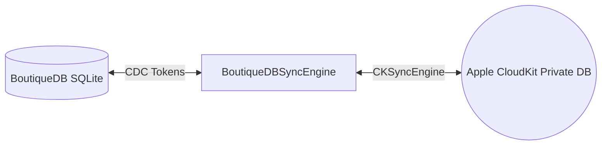

BoutiqueDB includes built-in sync support for Apple's **CloudKit** via `CKSyncEngine`. This enables multi-device data sync for iOS and macOS applications directly through the user's personal iCloud account.

---

## Architecture Overview

BoutiqueDB CloudKit Sync uses Change Data Capture (`turso_cdc`) to convert local SQLite row mutations into CloudKit `CKRecord` mutations:



---

## Step-by-Step Configuration

<Steps>
  <Step title="Enable CloudKit Capability in Xcode">
    1. Open your main App target in Xcode.
    2. Go to **Signing & Capabilities > + Capability > iCloud**.
    3. Check **CloudKit** and select or create an iCloud Container (e.g. `iCloud.com.example.MyApp`).
  </Step>

  <Step title="Register Synced Schemas">
    Specify which `@Table` schemas should be synchronized to CloudKit:

    ```swift SyncSetup.swift
    import BoutiqueDB

    let syncedTables = [
        try SyncedTable(schema: Note.self),
        try SyncedTable(schema: TaskItem.self)
    ]
    ```
  </Step>

  <Step title="Initialize & Attach Sync Engine">
    Attach the `BoutiqueDBSyncEngine` to your database instance:

    ```swift AppSync.swift
    let syncEngine = BoutiqueDBSyncEngine(
        containerIdentifier: "iCloud.com.example.MyApp",
        tables: syncedTables
    )

    syncEngine.attach(to: db, automaticallyDrain: true)
    ```
  </Step>
</Steps>

---

## Background sync

For automatic multi-device sync, register for remote notifications and background refresh:

```swift AppDelegate.swift
import UIKit
import BoutiqueDB

class AppDelegate: UIResponder, UIApplicationDelegate {
    var syncEngine: BoutiqueDBSyncEngine?

    func application(
        _ application: UIApplication,
        didFinishLaunchingWithOptions launchOptions: [UIApplication.LaunchOptionsKey: Any]? = nil
    ) -> Bool {
        syncEngine?.registerBackgroundTask()
        syncEngine?.registerForRemoteNotifications()
        return true
    }

    func application(
        _ application: UIApplication,
        didReceiveRemoteNotification userInfo: [AnyHashable: Any],
        fetchCompletionHandler completionHandler: @escaping (UIBackgroundFetchResult) -> Void
    ) {
        syncEngine?.handleRemoteNotification(userInfo: userInfo, fetchCompletionHandler: completionHandler)
    }

    func applicationDidEnterBackground(_ application: UIApplication) {
        syncEngine?.scheduleBackgroundSync(earliestBeginDate: Date(timeIntervalSinceNow: 15 * 60))
    }
}
```

On macOS, wire `handleRemoteNotification(userInfo:)` to `NSApplicationDelegate.application(_:didReceiveRemoteNotification:)` and call `scheduleBackgroundSync(interval:)` to set up an `NSBackgroundActivityScheduler`.

---

## Conflict Resolution & Device Testing

<AccordionGroup>
  <Accordion title="Last-Write-Wins Conflict Handling" icon="clock">
    By default, BoutiqueDB uses record modification timestamps to resolve edit conflicts between multiple devices. Newer local or remote timestamps take precedence.
  </Accordion>

  <Accordion title="Testing Sync on Physical Devices" icon="mobile-screen">
    CloudKit sync requires an active iCloud account signed in on an actual iOS device or macOS user account. Simulator sync requires signing into an Apple ID under iOS Settings.
  </Accordion>
</AccordionGroup>

<Note>
**Private Database Privacy**: All records are synced directly into the user's private iCloud database container. No user data is stored on external third-party servers!
</Note>
