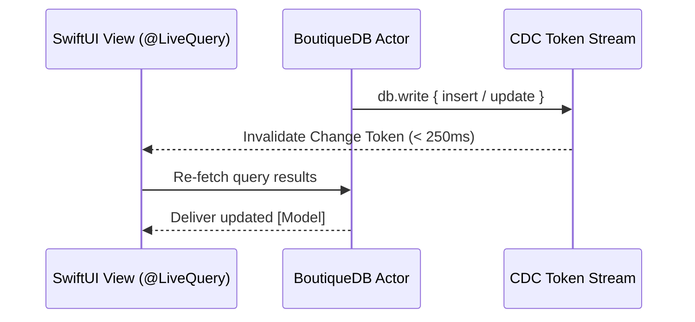

BoutiqueDB provides reactive UI updates without requiring heavy ORM observers, notification posting, or manual view refreshes.

---

## How CDC Live Queries Work

Whenever data is modified within a `db.write` block, BoutiqueDB generates Change Data Capture (CDC) events (`turso_cdc`). The `@LiveQuery` property wrapper listens to these change tokens and triggers view re-evaluations automatically.



---

## Query Types

### `@LiveQuery` (Array Queries)

Observes a list of matching records.

```swift
struct UncompletedTasksView: View {
    let db: BoutiqueDB

    @ObservationIgnored
    @LiveQuery var tasks: [TaskItem]

    init(db: BoutiqueDB) {
        self.db = db
        self._tasks = LiveQuery(db) {
            TaskItem.where { $0.isCompleted.eq(false) }
                .order { $0.dueDate.asc() }
                .asSelect()
        }
    }

    var body: some View {
        List(tasks, id: \.id) { task in
            Text(task.title)
        }
    }
}
```

---

### `@LiveQueryOne` (Single Record Queries)

Observes an optional single record (e.g. by unique primary key or single config setting).

```swift
struct UserProfileView: View {
    let db: BoutiqueDB
    let userId: UUID

    @ObservationIgnored
    @LiveQueryOne var profile: UserProfile?

    init(db: BoutiqueDB, userId: UUID) {
        self.db = db
        self.userId = userId
        self._profile = LiveQueryOne(db) {
            UserProfile.where { $0.id.eq(userId) }.asSelect()
        }
    }

    var body: some View {
        Group {
            if let profile {
                VStack {
                    Text(profile.name).font(.title)
                    Text(profile.email).foregroundStyle(.secondary)
                }
            } else {
                ProgressView()
            }
        }
    }
}
```

---

## Configuring CDC Refresh Interval

By default, BoutiqueDB checks CDC tokens every **250 ms**. You can adjust the polling frequency per database instance:

```swift
var config = BoutiqueConfiguration()
config.cdcPollInterval = .milliseconds(100) // Fast 100ms refresh

let db = try await BoutiqueDB.open(
    url: storeURL,
    configuration: config
)
```

<Note>
**Local Mutation Instant Invalidation**: When writes originate locally from the same process (`db.write`), `@LiveQuery` updates instantly without waiting for the CDC polling interval timer!
</Note>
